!SLIDE reverse

# Branching and Merging

!SLIDE gitcmd

# git branch

## Show all local branches

                   $ git branch

!SLIDE

# The default branch is named

# *master*

!SLIDE center

## Branches are just pointers to commits

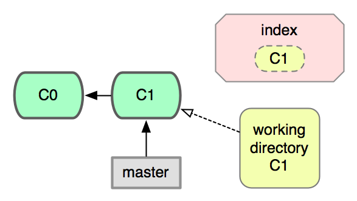

!SLIDE center

## It's easiest to think of the working
## directory as corresponding to a branch

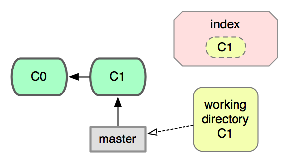

!SLIDE center

## As you commit, the branch moves with you

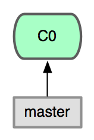

!SLIDE center

## As you commit, the branch moves with you

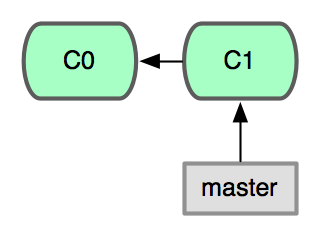

!SLIDE center

## As you commit, the branch moves with you

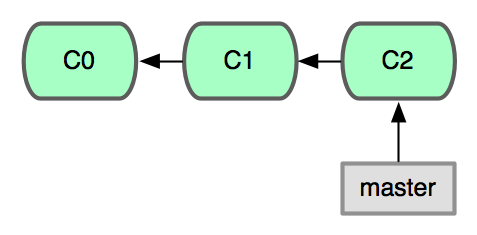

!SLIDE gitcmd

# git branch

## Create a new branch pointing at
## the current commit

              $ git branch uppercase

!SLIDE center

## A new branch has been created
## but the working dir has not changed

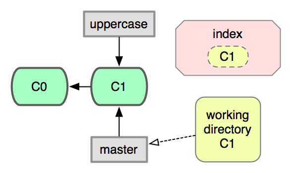

!SLIDE gitcmd

# git checkout

## Switch working dir to the given branch

             $ git checkout uppercase

!SLIDE center

## Working dir now corresponds to *uppercase*

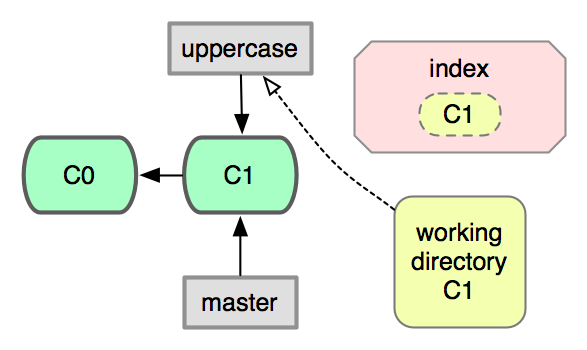

!SLIDE

## Convert the string to uppercase
## on this branch and commit the change

    $ vim hello.sh
    $ git add -p
    $ git commit -m 'convert string to uppercase'

!SLIDE center

## Branches have now diverged!

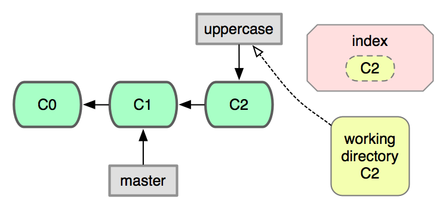

!SLIDE

## Switch back to the *master* branch.
## Notice that working dir has been changed.

<pre>
$ cat hello.sh        # uppercase version
$ git checkout master
$ cat hello.sh        # master version
</pre>

!SLIDE center

## Working directory is now consistent
## with the *master* branch

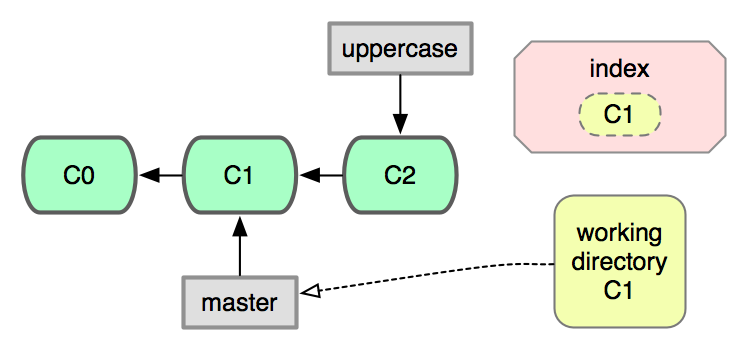

!SLIDE gitcmd

# git diff R1 R2

## Diff between two arbitrary commits

            $ git diff master uppercase

!SLIDE center

## Show the work done between branches

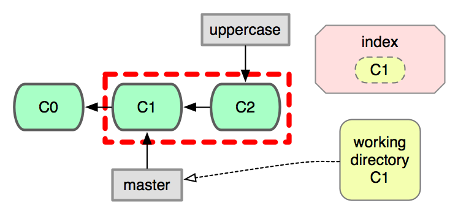

!SLIDE gitcmd

# git merge

## Merge the given commit into the current branch

              $ git merge uppercase

!SLIDE center

## Both branches now point at the same commit

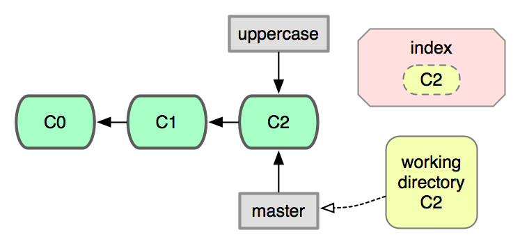

!SLIDE

## This kind of merge is known as a
## **fast-forward merge** because the
## merged branch was a direct descendent

!SLIDE gitcmd

# git branch -d

## Delete the given branch

             $ git branch -d uppercase

!SLIDE center

## Only the pointer has been deleted

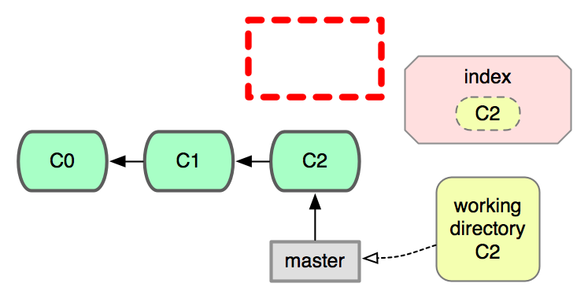

!SLIDE center

## What if both branches have commits?

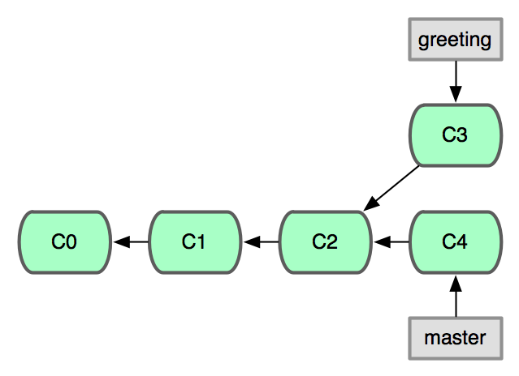

!SLIDE gitcmd

# git checkout -b

## Create a new branch and switch to it

            $ git checkout -b greeting

!SLIDE

## Modify the greetings; commit;
## and switch back to *master*

          $ vim hello.sh
          $ vim goodbye.sh
          $ git add -p
          $ git commit -m 'new greetings'
          $ git checkout master

!SLIDE

## Create a new file on *master*
## and attempt to add it

<pre>
  $ vim README
  $ git add -p       # nothing to review!
  $ git status       # find out why
</pre>

!SLIDE

# File tracking

## Git remembers what files have been added.
## New files must be explicitly added.

!SLIDE

## Add the contents of the new file

<pre>
    $ git add .   # add everything!
    $ git status  # see that it worked
</pre>

!SLIDE

## Oops, we forgot something...

<pre>
    $ vim README
    $ git status        # make sure
</pre>

!SLIDE center

## Two deltas have been introduced

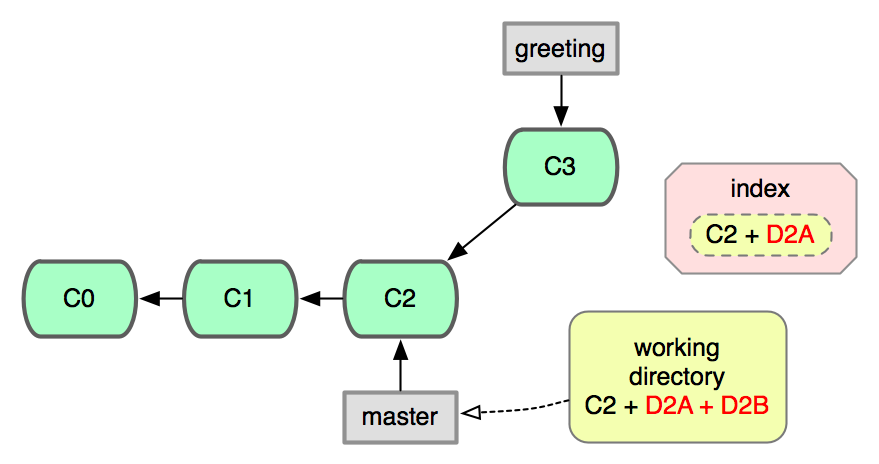

!SLIDE

## Inspect the deltas, and continue

<pre>
     $ git diff --staged # old change
     $ git diff          # new change
     $ git add -p        # add again
     $ git commit -m "add a readme"
</pre>

!SLIDE

# Fixing mistakes

!SLIDE gitcmd

# git commit --amend

## Modify the content of the **last commit**

<pre>
           $ vim README
           $ git add -p
           $ git commit --amend
</pre>

!SLIDE center

## Recap of forked lineage

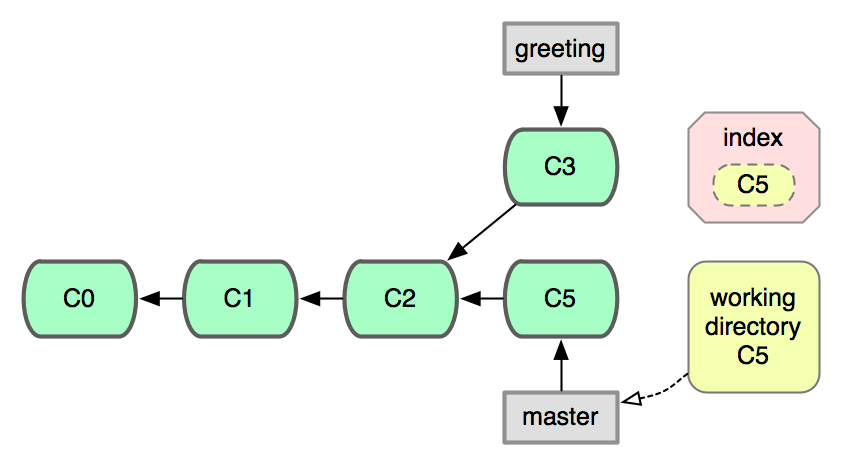

!SLIDE

## Merge *greeting* into *master*

               $ git merge greeting

!SLIDE center

## A new merge commit (C5) is created

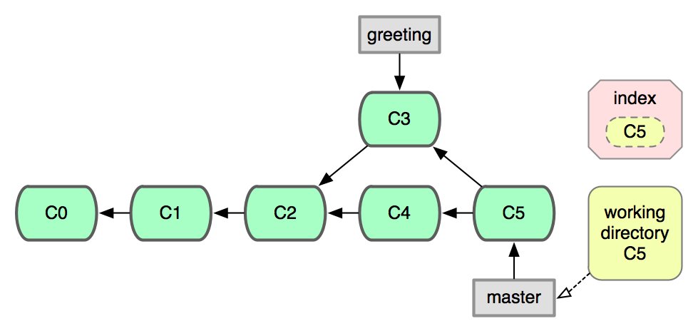

!SLIDE gitcmd

# git log --graph

## Show the commit log with graph structure

<pre>
             $ git log --graph
</pre>

!SLIDE

## This kind of merge is known as
## a **recursive merge** and
## uses a 3-way merge strategy

!SLIDE center

## Three way (recursive) merge strategy

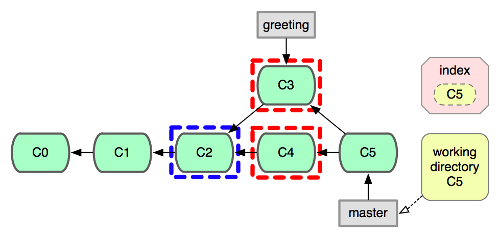

!SLIDE

# The power of Undo

!SLIDE

# First, a word about references

## A reference is a way to refer to a commit

!SLIDE bullets

# Examples:

* 5c673e53912d86eb771ee0ab0c678ecffa4b939c
* 5c673e5
* master
* HEAD
* HEAD^^

!SLIDE

## *HEAD* is a dynamic reference that
## follows your current checkout

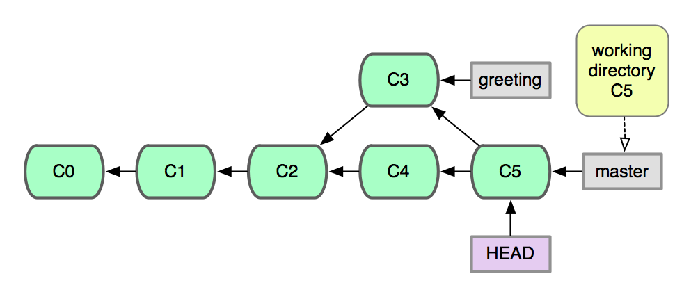

!SLIDE

## *HEAD* is a dynamic reference that
## follows your current checkout

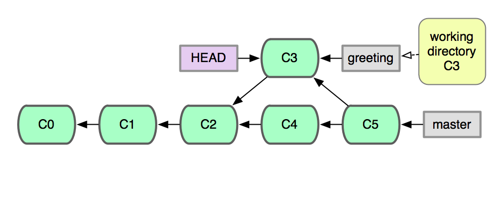

!SLIDE

## *HEAD* is a dynamic reference that
## follows your current checkout

!SLIDE center

## Ancestry reference modifiers

!SLIDE gitcmd

# git reset --hard

## Reset a branch and working dir

              $ git reset --hard head^

!SLIDE center

## *master* is now pointing to C4.
## C5 still exists, but is **dangling**.

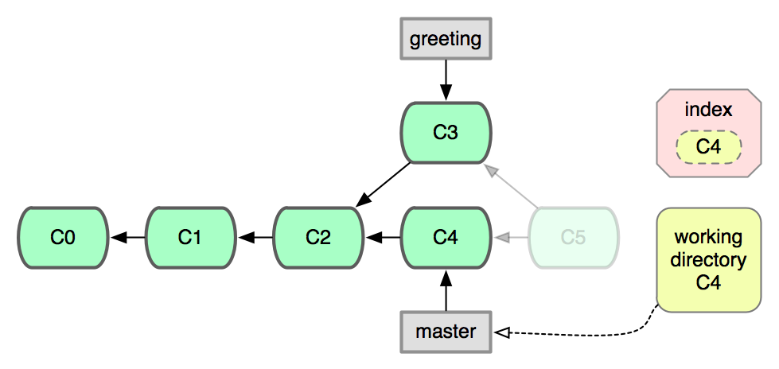

!SLIDE gitcmd

# git reflog

## Show previous values of *HEAD*

                   $ git reflog

!SLIDE

# Let's induce a merge conflict

!SLIDE

## Modify a line that was also changed
## in the *greeting* branch

          $ vim hello.sh
          $ git add -p
          $ git commit -m 'howdy pardner'

!SLIDE

## Attempt to merge *greeting*

               $ git merge greeting

