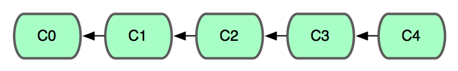
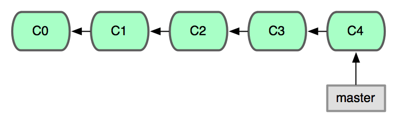
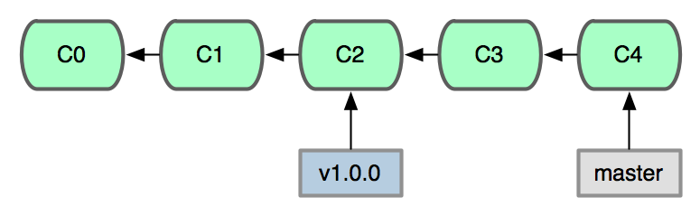

!SLIDE

# Getting an existing repository

!SLIDE

!SLIDE commandline

    $ cd my/repos

!SLIDE

# git clone

!SLIDE commandline

    $ git clone git://github.com/mojombo/ernie.git
    Initialized empty Git repository in /Users/tom/my/repos/ernie/.git/
    remote: Counting objects: 748, done.
    remote: Compressing objects: 100% (528/528), done.
    remote: Total 748 (delta 442), reused 266 (delta 148)
    Receiving objects: 100% (748/748), 92.63 KiB | 167 KiB/s, done.
    Resolving deltas: 100% (442/442), done.

!SLIDE commandline

    $ cd ernie

!SLIDE commandline incremental

    $ ls -al
    total 80
    drwxr-xr-x   19 tom  staff    646 Mar 20 19:09 .
    drwxr-xr-x  116 tom  staff   3944 Mar 20 19:09 ..
    -rw-r--r--    1 tom  staff     58 Mar 20 19:09 .document
    drwxr-xr-x   13 tom  staff    442 Mar 20 19:09 .git
    -rw-r--r--    1 tom  staff     11 Mar 20 19:09 .gitignore
    -rw-r--r--    1 tom  staff    948 Mar 20 19:09 History.txt
    -rw-r--r--    1 tom  staff   1062 Mar 20 19:09 LICENSE
    -rw-r--r--    1 tom  staff  10002 Mar 20 19:09 README.md
    -rw-r--r--    1 tom  staff   1900 Mar 20 19:09 Rakefile
    -rw-r--r--    1 tom  staff     44 Mar 20 19:09 VERSION.yml
    drwxr-xr-x    3 tom  staff    102 Mar 20 19:09 bin
    drwxr-xr-x    3 tom  staff    102 Mar 20 19:09 contrib
    drwxr-xr-x    3 tom  staff    102 Mar 20 19:09 ebin
    drwxr-xr-x   17 tom  staff    578 Mar 20 19:09 elib
    -rw-r--r--    1 tom  staff   2733 Mar 20 19:09 ernie.gemspec
    drwxr-xr-x    6 tom  staff    204 Mar 20 19:09 examples
    drwxr-xr-x    4 tom  staff    136 Mar 20 19:09 ext
    drwxr-xr-x    3 tom  staff    102 Mar 20 19:09 lib
    drwxr-xr-x    7 tom  staff    238 Mar 20 19:09 test

!SLIDE

# git log

!SLIDE commandline incremental

    $ git log
    commit 3ca43e12377ea1e32ea5c9ce5992ec8bf266e3e5
    Author: Tom Preston-Werner <tom@mojombo.com>
    Date:   Fri Mar 12 15:22:34 2010 -0800

        Regenerated gemspec for version 2.2.0

    commit 5ec521178e0eec4dc39741a8978a2ba6616d0f0a
    Author: Tom Preston-Werner <tom@mojombo.com>
    Date:   Fri Mar 12 15:21:49 2010 -0800

        Version bump to 2.2.0

    commit 3f65e48771908b4cbc07aa008a5e18a71b8ad040
    Author: Tom Preston-Werner <tom@mojombo.com>
    Date:   Fri Mar 12 15:07:02 2010 -0800

        display args in procline

!SLIDE

## A Git repository is a collection of commits

!SLIDE

## A commit is a snapshot of the file system
## at a specific point in time

!SLIDE center

## A Git repo is a collection of snapshots
## of the file system that remember their ancestry

!SLIDE

# Git calls snapshots "commits"

!SLIDE center

# Branches are just pointers

!SLIDE center

# Tags are just pointers too!

!SLIDE bullets incremental

# References

* 00b362e62ce01b8539be71b14fb909e74aaf36be
* 00b362e
* master
* mybranch
* v1.0.0

!SLIDE bullets incremental

# More References

* head
* head^
* head~10

!SLIDE

# git checkout

!SLIDE commandline incremental

    $ git checkout v1.0.0
    Note: moving to 'v1.0.0' which isn't a local branch
    If you want to create a new branch from this checkout, you may do so
    (now or later) by using -b with the checkout command again. Example:
      git checkout -b <new_branch_name>
    HEAD is now at f52698a... Regenerated gemspec for version 1.0.0

