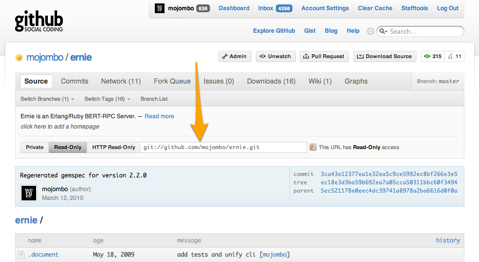
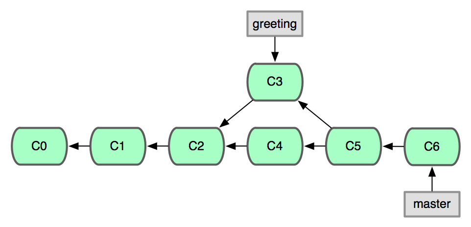
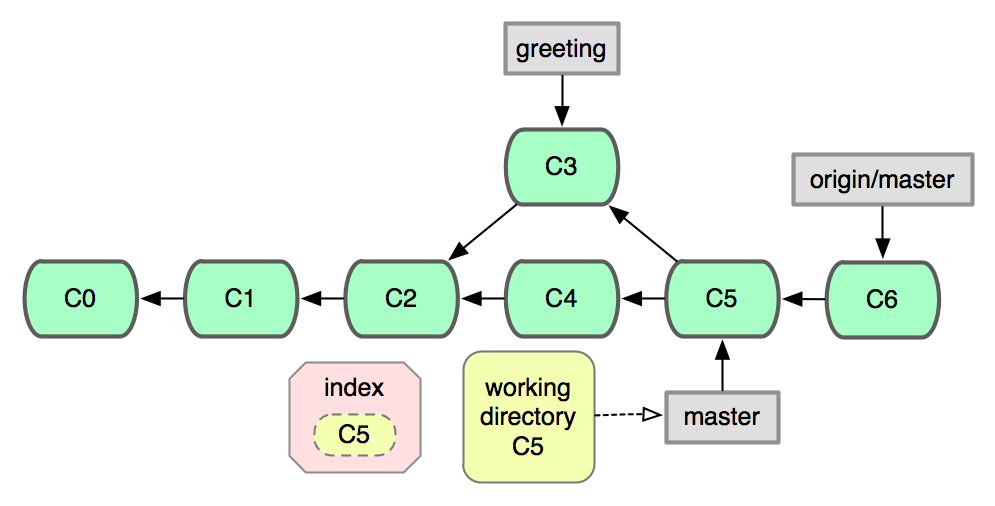
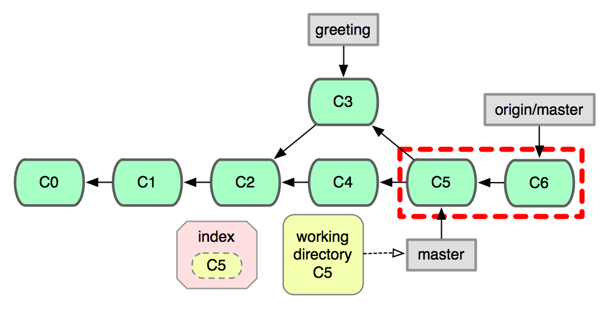
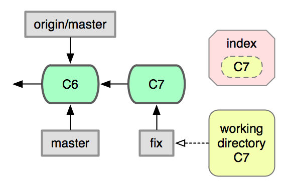
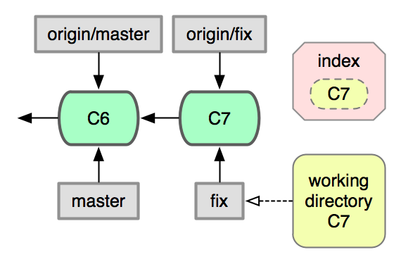
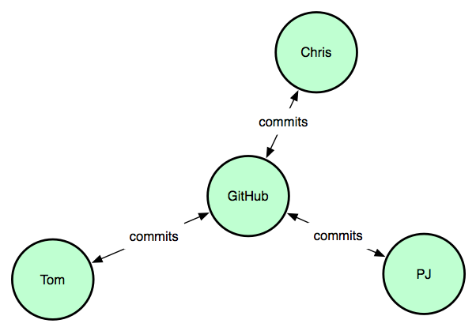

!SLIDE reverse

# Collaboration

!SLIDE

## Back to your repos directory

                     $ cd ..

!SLIDE gitcmd

# git clone

## Clone a repository

           $ git clone hello helloclone
           $ cd helloclone

!SLIDE center

## You can also clone from remote repositories

!SLIDE gitcmd

# git remote

## Display a list of remotes

                  $ git remote -v

!SLIDE gitcmd

# git branch -a

## Show all branches (local and remote)

                  $ git branch -a

!SLIDE

## Assume that upstream makes a commit
## on the *master* branch

!SLIDE center

## Current state of **upstream**

!SLIDE gitcmd

# git fetch

## Fetch commits from the given remote

                $ git fetch origin

!SLIDE center

## Remote commits have been downloaded,
## but have not affected your local branches

!SLIDE

## View the changes in the upstream
## *origin/master* branch

           $ git diff head origin/master

!SLIDE center

## Comparing unmerged upstream commits

!SLIDE

## Merge the upstream *origin/master* branch
## into your local *master* branch

             $ git merge origin/master

!SLIDE center

## The upstream commits have been merged

!SLIDE

## What if you want to share **your** changes?

!SLIDE center

## Assume a new branch *fix* with a commit

!SLIDE gitcmd

# git push

## Push some commits to a remote

               $ git push origin fix

!SLIDE center

## Remote now contains the *fix* branch!

!SLIDE

## Now others that have access to the remote
## can fetch and work on the *fix* branch

!SLIDE center

## Collaboration in Git is all about moving
## commits around between repositories

