!SLIDE reverse

# Creating and Committing

!SLIDE

## Make a directory for your new project

               $ cd path/to/repos
               $ mkdir hello
               $ cd hello

!SLIDE center

## Working directory

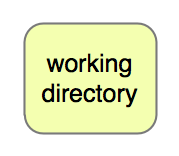

!SLIDE gitcmd

# git init

<pre>
      $ ls -al    # dir is empty
      $ git init  # initialize git repo
      $ ls -al    # new .git dir
</pre>

!SLIDE center

## Behold the index!

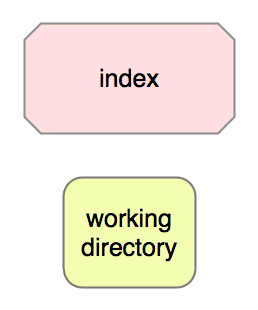

!SLIDE

## Write some code

                  $ vim hello.sh
                  $ vim goodbye.sh

!SLIDE gitcmd

# git add

<pre>
$ git add hello.sh   # add content to index
$ git add goodbye.sh # add content to index
</pre>

!SLIDE center

## Index now contains working dir content

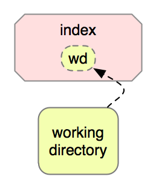

!SLIDE gitcmd

# git status

## Show the status of index and working dir

<pre>
               $ git status
</pre>

!SLIDE gitcmd

# git commit

<pre>
      $ git commit  # make a commit
</pre>

!SLIDE center

## A commit is a snapshot taken from the index

<h2 style="color: red">NOT THE WORKING DIRECTORY</h2>

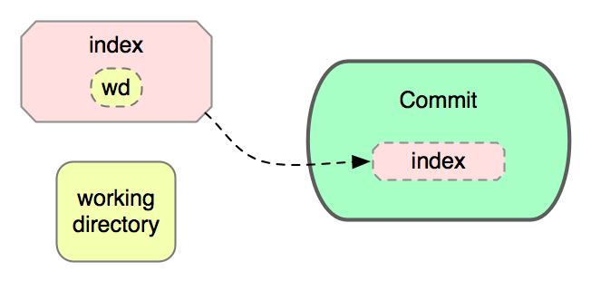

!SLIDE gitcmd

# git log

## Print a log of commits

<pre>
                 $ git log
</pre>

!SLIDE center

# Recap

## The current state of the repo

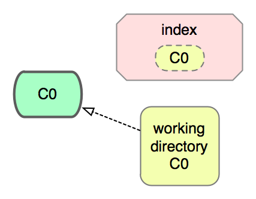

!SLIDE

## Make some ambitious changes

<pre>
     $ vim hello.sh  # modify the file
</pre>

!SLIDE center

## Working dir now contains D0: a delta from C0

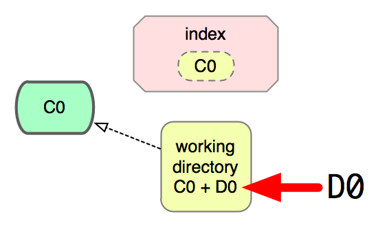

!SLIDE

## Review the changed files

<pre>
               $ git status
</pre>

!SLIDE gitcmd

# git diff

## Show diff between index and working dir

<pre>
                $ git diff
</pre>

!SLIDE center

## D0 = Diff(Index, WorkingDir)

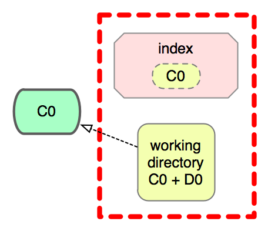

!SLIDE gitcmd

# git add -p

## Interactively add changed hunks

<pre>
               $ git add -p
</pre>

!SLIDE center

## D0 is now in working dir AND index

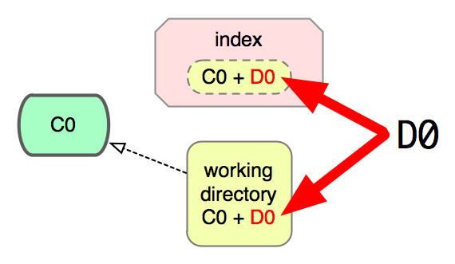

!SLIDE

# **git diff** now shows nothing!

## Where did it go?

!SLIDE gitcmd

# git diff --staged

## Show diff between commit and index

<pre>
            $ git diff --staged
</pre>

!SLIDE center

## D0 = Diff(Commit, Index)

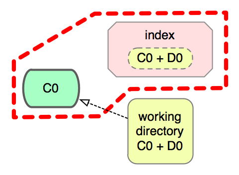

!SLIDE gitcmd

# git commit -m

## Create a commit with the given commit message

         $ git commit -m "more ambition!"

!SLIDE center

## Commit is rolled from index

!SLIDE center

# Recap

## Two commits, C0 and C1

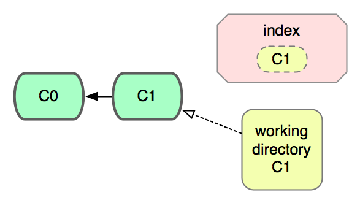

!SLIDE center

## Ever commit has zero or
## more parent commits

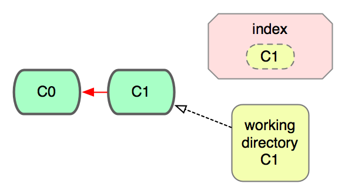