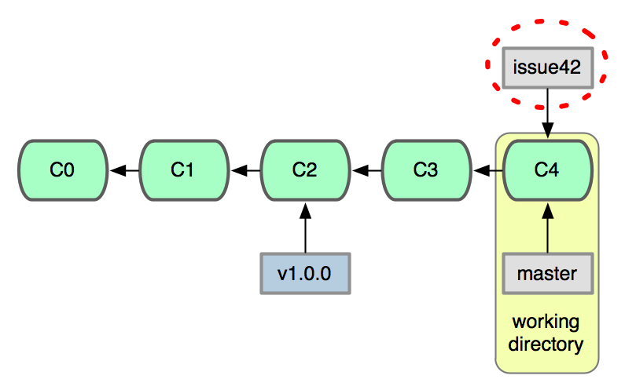
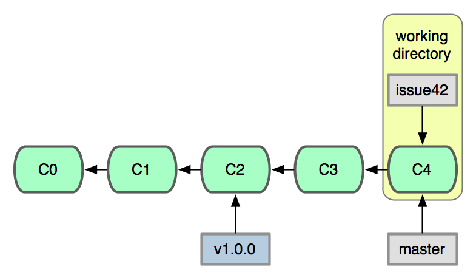

!SLIDE subsection

# Modifying a Git Repository

!SLIDE

# Creating a new branch

!SLIDE

# git branch

!SLIDE commandline

    $ git branch issue42

!SLIDE center

## The new branch points to the same commit as the
## branch you were on when you ran the command

!SLIDE

# git checkout

!SLIDE commandline

    $ git checkout issue42
    Switched to branch 'issue42'

!SLIDE center

## The checkout command changes the working
## directory to contain the new branch

!SLIDE

# git checkout -b

!SLIDE commandline

    $ git checkout -b issue42